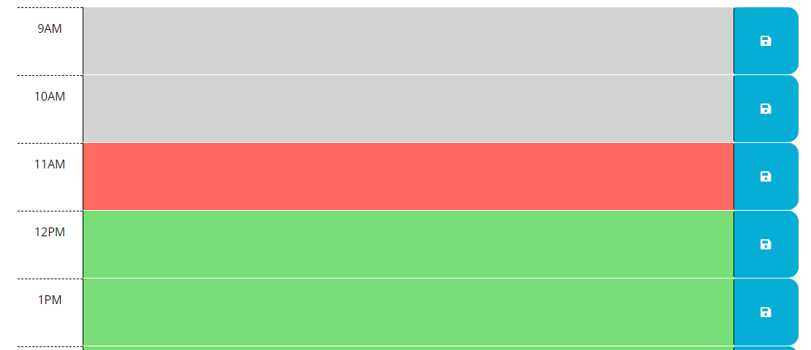

# Calendar

## Week 3 Module 5 Challenge - UCI Bootcamp

This was our fifth challenge project of our bootcamp. Overall, we were given some basic HTML, CSS, and JavaScript code to work with. We were told to create a website that allowed users to put in tasks that they needed to complete for the day. This one was a little tricky at first, but I first started with the easiest task, which was to display the current date. Then, I thought of how to change the background color depending on the time. I thought of running a for loop originally, but then I remembered that I could do the .each() that allowed me to basically do a for loop for functions. Once I finished this, I went back tackle the button, which I grabbed the data and id attributes and then saved it to a localStorage. This is the part that I ran into trouble, as I tried once again to use the .each() to call the data back from the localStorage, but this did not work, so I asked Instructor Quinton for help.  

## Table of Contents

- [Installation](#installation)
- [Usage](#usage)
- [Credits](#credits)
- [License](#license)

## Installation

N/A

## Usage

The website is live [Calendar][https://wangbrian26.github.io/Calendar/]

This is a calendar that allows users to input the tasks that they want to complete for the day. 

When you go onto the page, you will first see today's date. 

Then, the times of the day are listed to the left with discription boxes to the right of the times. Next to the description boxes is a blue save button. Users will enter in the task that they want to accomplish at the specific time they want to accomplish it at. Then, users will click the blue save button that will save their task even if they refresh the page. 

According to the time the user is accessing the website, the time and description boxes will have different colors.

- If the time is in the past, it will be greyed out to indicate that that time has passed.
- If the time is current, it will be red to indicate that this time block is the present.
- If the time is in the future, it will be green to indicate that tehre is still time to accomplish that task.

## Credits

Thanks to Instructor Quinton Fults, TA Takara Truong, and TA Black Marcus for helping with the learning on these elements. 

## License

N/A